# Java Spring Boot 專案

## 作業一 : CRUD 功能

### 簡介
建立基本的 CRUD（新增、查詢、更新、刪除）API，允許使用者與 `users` 資料表互動，執行查詢所有使用者、根據 ID 查詢單一使用者、新增使用者、更新使用者資訊及刪除使用者的操作。


### 資料庫配置
修改 `application.properties` 符合資料庫設定：
```
spring.application.name=demo
spring.datasource.username=user
spring.datasource.password=password
spring.datasource.url=jdbc:postgresql://localhost:5432/postgres
```
### API 端點
API 提供以下功能：

#### 1. 查詢所有使用者
- **方法:** GET
- **URL:** `http://localhost:8080/users`
- **回應:** 以 JSON 格式返回所有使用者

#### 2. 根據 ID 查詢單一使用者
- **方法:** GET
- **URL:** `http://localhost:8080/users/{id}`
- **回應:** 返回該使用者的詳細資訊，若無對應 ID 則回傳空回應

#### 3. 新增使用者
- **方法:** POST
- **URL:** `http://localhost:8080/users`
- **請求 Body:** JSON 格式的使用者資訊
  ```json
  {
    "username": "john_doe",
    "email": "john@example.com",
    "firstname": "John",
    "lastname": "Doe"
  }
  ```
- **回應:** 返回新增的使用者資訊

#### 4. 更新使用者資訊
- **方法:** PUT
- **URL:** `http://localhost:8080/users/{id}`
- **請求 Body:** JSON 格式的更新後使用者資訊
  ```json
  {
    "username": "john_doe_updated",
    "email": "john_updated@example.com",
    "firstname": "John",
    "lastname": "Doe"
  }
  ```
- **回應:** 返回更新後的使用者資訊

#### 5. 刪除使用者
- **方法:** DELETE
- **URL:** `http://localhost:8080/users/{id}`
- **回應:** 若刪除成功回傳 `True`，否則回傳 `False`

### Swagger API 文件
啟動應用程式後，可透過以下網址查看 API 文件：
```
http://localhost:8080/swagger-ui.html
```
此介面可用於測試 API 端點

## 0318 Hibernate + Swagger Api

## 0325 HTML + CSS + JavaScript 部分 (static/user.html)

### 1. 簡介
本專案透過 **HTML、CSS 和 JavaScript** 開發，提供 **新增、編輯、刪除、列出使用者** 的前端功能，並透過 API 與後端進行互動。

### 2. 使用方法
####  伺服器啟動
1. 啟動後端 API (確保 Spring Boot 服務已執行)
2. 在瀏覽器輸入 `http://localhost:8080/user.html`

### 3. 功能概覽
- **使用者管理**
  - 顯示使用者列表
  - 新增 / 編輯 / 刪除使用者
- **系所管理**
  - 選擇現有系所
  - 可新增新系所

### 4. API 端點 (後端)
| 方法  | 路徑          | 功能說明            |
|------|-------------|------------------|
| GET  | /users      | 取得所有使用者      |
| POST | /users      | 新增使用者        |
| PUT  | /users/:id  | 更新使用者資訊      |
| DELETE | /users/:id | 刪除使用者        |

### 5. 頁面結構
#### (1) **HTML**
- **使用者列表** (顯示來自 API 的資訊)
- **按鈕**：新增 / 編輯 / 刪除
- **彈出視窗 (Modal)** 供新增與編輯用

#### (2) **CSS**
- **佈局**：使用 `Flexbox` 提供響應式設計
- **按鈕樣式**：`hover` 動畫、顏色變換
- **彈出視窗**：`position: fixed` 控制顯示效果

#### (3) **JavaScript**
- `loadUsers()`：從 API 獲取並顯示使用者列表
- `openCreateModal()`：開啟新增使用者表單
- `editUser()`：編輯使用者
- `saveUser()`：儲存或更新使用者資訊
- `deleteUser()`：刪除使用者
- `closeModal()`：關閉彈出視窗

### 6. 畫面範例
#### **新增使用者**


#### **編輯使用者**


#### **刪除使用者**

**使用者列表：**
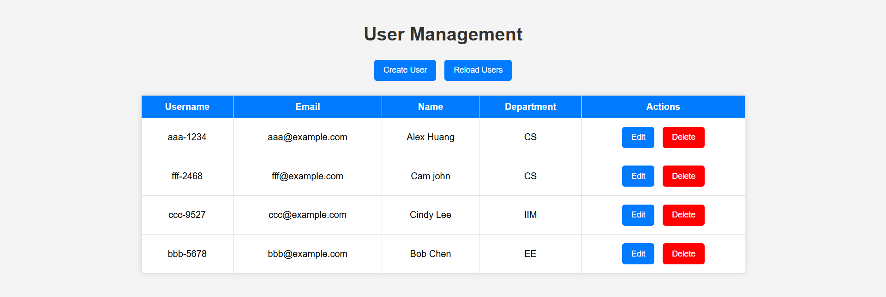

**Create User (彈出式表單 Modal)：**
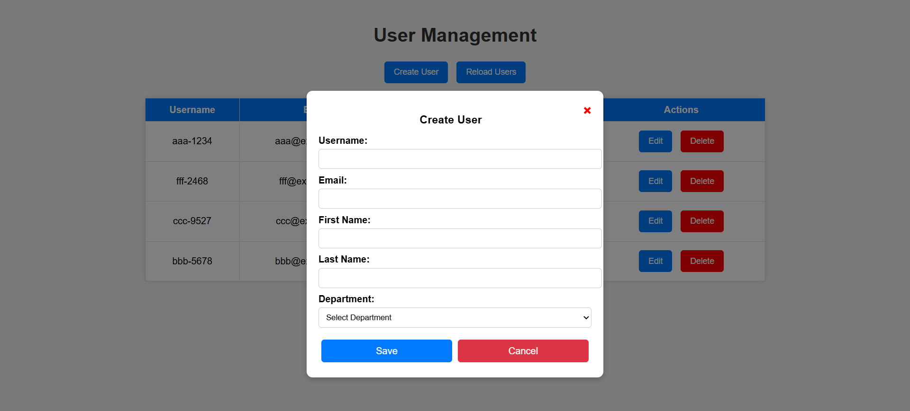

**Create User : 選擇系所(Department)：**
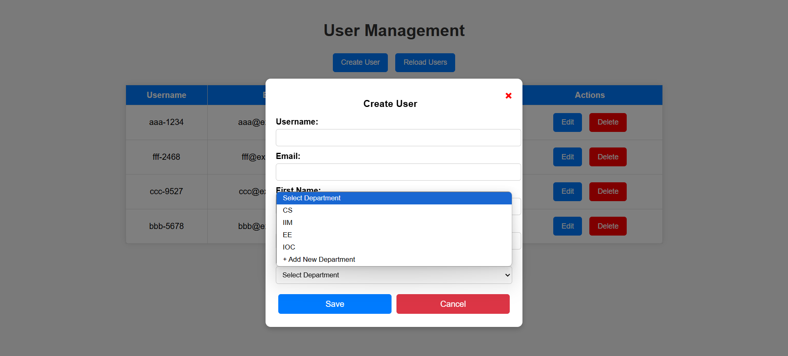

**Create User : 創建新系所：**
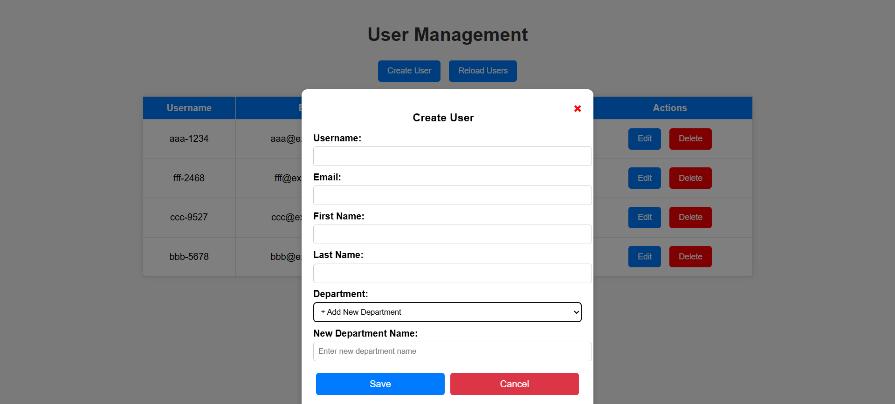

**創建新系所前資料庫：**
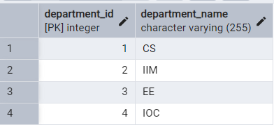

**Create User : 禁止資料為空：**
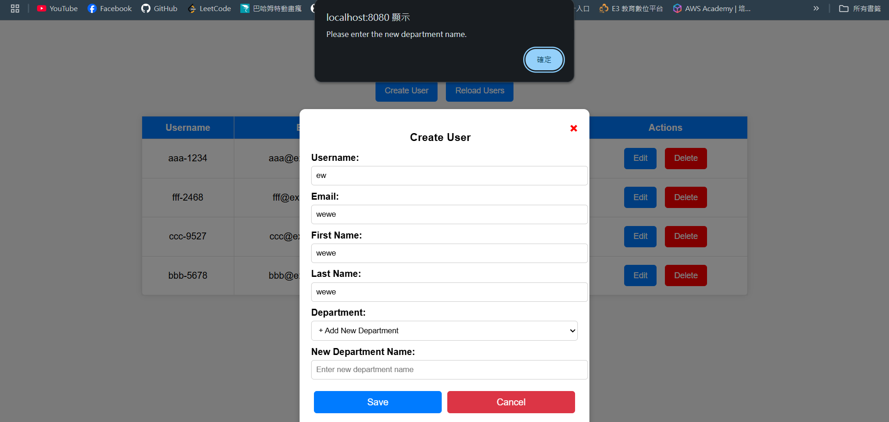

**Create User : 完成結果(1)沒有創建新系所：**
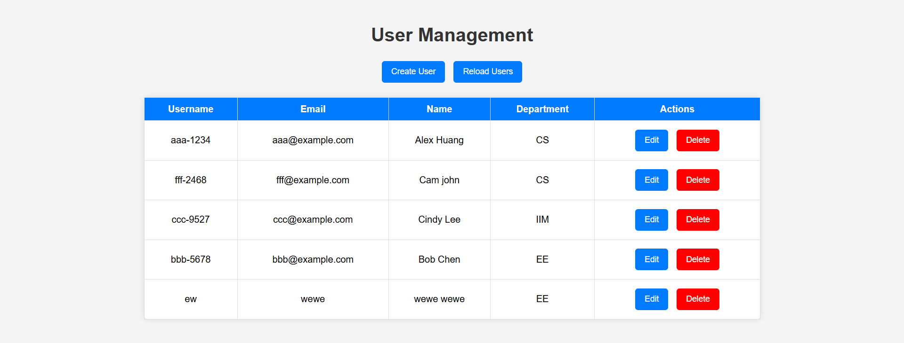

**Create User : 完成結果(2)創建新系所：**
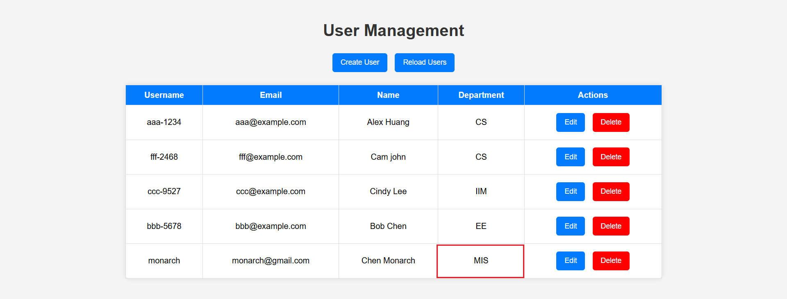

**創建新系所後資料庫：**
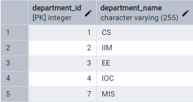

**Edit User : 修改表單內容：**
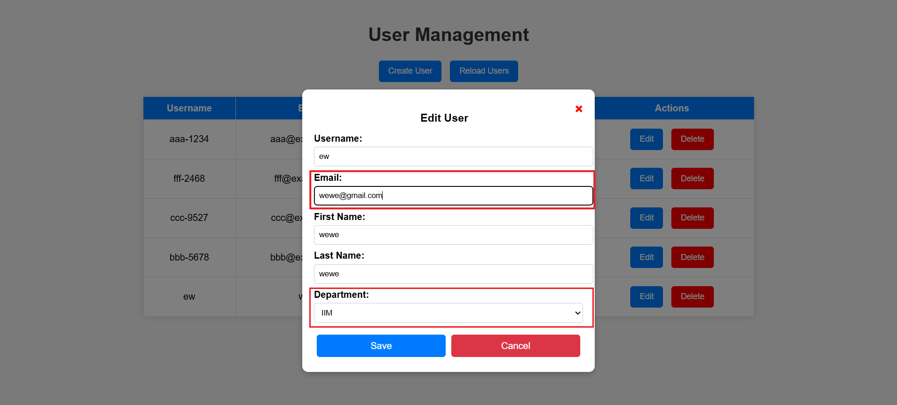

**Edit User : 修改完成結果：**
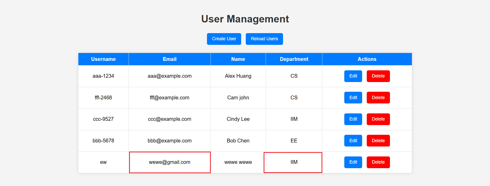

**Delete User : 刪除跳出視窗：**
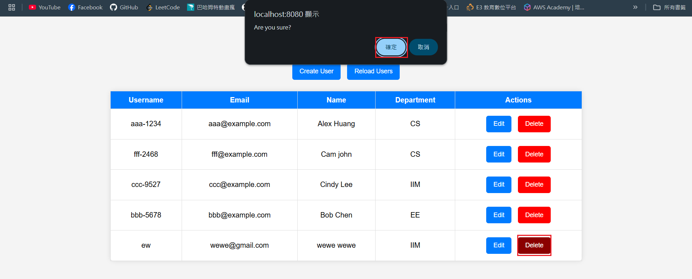

**Delete User : 刪除完成結果：**
