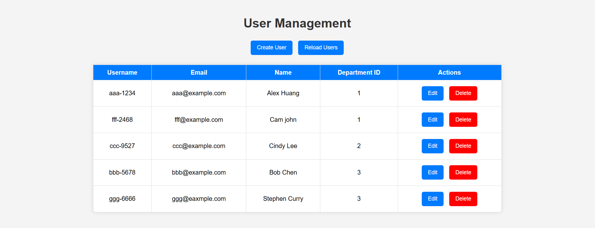
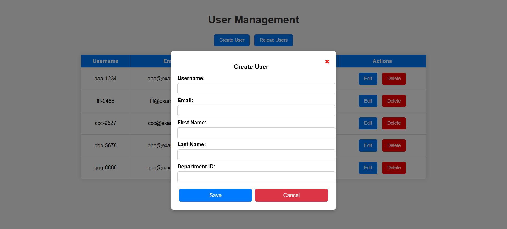

# Java Spring Boot 專案

## 作業一 : CRUD 功能

### 簡介
建立基本的 CRUD（新增、查詢、更新、刪除）API，允許使用者與 `users` 資料表互動，執行查詢所有使用者、根據 ID 查詢單一使用者、新增使用者、更新使用者資訊及刪除使用者的操作。


### 資料庫配置
修改 `application.properties` 符合資料庫設定：
```
spring.application.name=demo
spring.datasource.username=user
spring.datasource.password=password
spring.datasource.url=jdbc:postgresql://localhost:5432/postgres
```
### API 端點
API 提供以下功能：

#### 1. 查詢所有使用者
- **方法:** GET
- **URL:** `http://localhost:8080/users`
- **回應:** 以 JSON 格式返回所有使用者

#### 2. 根據 ID 查詢單一使用者
- **方法:** GET
- **URL:** `http://localhost:8080/users/{id}`
- **回應:** 返回該使用者的詳細資訊，若無對應 ID 則回傳空回應

#### 3. 新增使用者
- **方法:** POST
- **URL:** `http://localhost:8080/users`
- **請求 Body:** JSON 格式的使用者資訊
  ```json
  {
    "username": "john_doe",
    "email": "john@example.com",
    "firstname": "John",
    "lastname": "Doe"
  }
  ```
- **回應:** 返回新增的使用者資訊

#### 4. 更新使用者資訊
- **方法:** PUT
- **URL:** `http://localhost:8080/users/{id}`
- **請求 Body:** JSON 格式的更新後使用者資訊
  ```json
  {
    "username": "john_doe_updated",
    "email": "john_updated@example.com",
    "firstname": "John",
    "lastname": "Doe"
  }
  ```
- **回應:** 返回更新後的使用者資訊

#### 5. 刪除使用者
- **方法:** DELETE
- **URL:** `http://localhost:8080/users/{id}`
- **回應:** 若刪除成功回傳 `True`，否則回傳 `False`

### Swagger API 文件
啟動應用程式後，可透過以下網址查看 API 文件：
```
http://localhost:8080/swagger-ui.html
```
此介面可用於測試 API 端點

## 0318 Hibernate + Swagger Api

## 0325 HTML + CSS + Javascript 部分
### 概述
本周使用 **HTML、CSS 和 JavaScript** 開發，提供前端頁面來進行 **新增、編輯、刪除及列出使用者** 的功能。

#### 主要功能
- **使用者列表顯示**：從後端 API 取得並顯示使用者資訊。
- **新增使用者**：透過彈出視窗輸入使用者資料並儲存。
- **編輯使用者**：允許修改現有使用者資訊。
- **刪除使用者**：提供刪除按鈕，並附帶確認提示。

#### 連接後端 API（可選）
本專案使用後端提供的 API 端點：
- `GET /users` → 取得所有使用者
- `POST /users` → 新增使用者
- `PUT /users/:id` → 更新使用者資訊
- `DELETE /users/:id` → 刪除使用者

#### 程式碼概覽
##### 1. **HTML**
- 主畫面包含：
  - **新增使用者** 按鈕開啟表單。
  - **使用者列表** 顯示後端取得的資料。
  - **彈出視窗 (Modal)** 用於輸入或編輯使用者資訊。

##### 2. **CSS**
- 為頁面佈局、按鈕、表格和彈出視窗提供樣式。
- 包含懸停效果、表格樣式、彈出視窗設計。

##### 3. **JavaScript**
- `loadUsers()`：從 API 獲取並顯示使用者列表。
- `openCreateModal()`：開啟新增使用者的表單。
- `editUser()`：開啟編輯使用者的表單，並填入現有資料。
- `saveUser()`：儲存或更新使用者資訊。
- `deleteUser()`：刪除使用者，並附帶確認提示。
- `closeModal()`：關閉彈出視窗。

#### 畫面範例
**使用者列表：**


**彈出式表單 (Modal)：**

